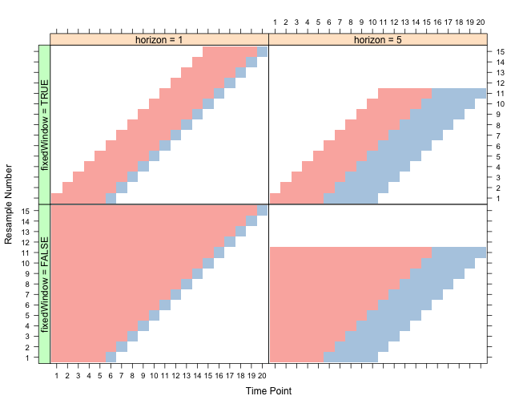

```{r "setup", include=FALSE}
# Configuration locale du chemin du projet SIWIM :
knitr::opts_knit$set(root.dir = normalizePath("D:/Dropbox/Data science/Formation CEPE/Projet/GitHub/SiWIM-project")) 
# options(encoding = 'UTF-8')
#options(width = 1000)
```

```{r "funggcast", include=FALSE}

#--Produces a data.frame with the Source Data+Training Data, Fitted Values+Forecast Values, forecast data Confidence Intervals
funggcast<-function(dn,fcast){ 
 
	en<-length(fcast$fitted) #extract the max date used in the forecast
 
	#Extract Source and Training Data
	ds<-as.data.frame(dn)
	names(ds)<-'observed'
	ds$date<-index(dn)
 
	#Extract the Fitted Values (need to figure out how to grab confidence intervals)
	dfit<-as.data.frame(fcast$fitted)
	dfit$date<-index(dn)[1:en]
	names(dfit)[1]<-'fitted'
 
	ds<-merge(ds,dfit,all.x=T) #Merge fitted values with source and training data
 
	#Exract the Forecast values and confidence intervals
	dfcastn<-as.data.frame(fcast)
	dfcastn$date<-index(dn)[(en+1):length(dn)]
	names(dfcastn)<-c('forecast','lo80','hi80','lo95','hi95','date')
 
	pd<-merge(ds,dfcastn,all.x=T) #final data.frame for use in ggplot
	return(pd)
 
}


```

<style>
    body .main-container {
        max-width: 1000px;
    }
</style>

# Introduction

L'objet de cette page est de présenter l'approche adoptée pour analyser les donneés temporelles
associées aux camions et captées par le système SIWIM, puis pour construire le meilleur modèle 
de prédiction possible.


```{r "librairies", include=FALSE}
# chargement des librairies 

library(forecast) #prédiction sur les modèles classiques
library(ggplot2) #graphiques sur les données
library(plotly)
library(data.table) #manipulation des données
library(xts)# extensible time series
library(dygraphs) # Nice graphs for time series
library(imputeTS) #Missing values in time series
library(tseries) # Augmented Dickey-Fuller test
library(knitr)
library(magrittr)
library(kableExtra)
library(scales)

```


```{r "chargement donnees", include=FALSE}

# Chargement
siwim_data <- fread("2_Data/2_Retraitees/SiWIM_data_after_input.csv")

# Structure du fichier
#str(siwim_data)
# data.frame(variable = names(siwim_data),
#            classe = sapply(siwim_data, typeof),
#            first_values = sapply(siwim_data, function(x) paste0(head(x),  collapse = ", ")),
#            row.names = NULL) %>% 
#   kable("html") %>%
#   kable_styling()

```


```{r "data transformation", echo=FALSE, message=FALSE, warning=FALSE}

#Format date & time
siwim_data[, Timestamp := as.POSIXct(substr(siwim_data$Timestamp,1,19), format = '%Y-%m-%d %H:%M:%S')]

siwim_data[, Date := as.Date(siwim_data$Date)]

# Refactor time data

cols <- c(
  "Mois_annee",
  "Jour_semaine",
  "Heure",
  "Axle_groups"
)

siwim_data[, (cols) := lapply(.SD, function(x) as.factor(x)), .SDcols=cols]

# Heure au format numérique
siwim_data[,Heure_num := as.numeric(Heure)]

#Delete unuseful columns
maxN <- 8
axles_load <- paste("A", 1:(maxN-1), sep = "")
axles_mass <- paste("M", 1:maxN, sep = "")

useless_cols <- c(axles_load,axles_mass, "Site_ID")

siwim_data[, (useless_cols) := NULL]

# Structure apres conversions
#str(siwim_data)
# data.frame(variable = names(siwim_data),
#            classe = sapply(siwim_data, typeof),
#            first_values = sapply(siwim_data, function(x) paste0(head(x),  collapse = ", ")),
#            row.names = NULL) %>% 
#   kable("html") %>%
#   kable_styling()
```

# 1. Calcul des données avec le pas temporel donné

Nous avons décidé de partir sur une prévision dans l'heure, donc nous allons agréger les donnnées par date et par heure. Par cette opération, nous allons compter le nombre de camions, sommer les poids et les distances entre esseiux des camions et enfin prendre la moyenne de température, de la vitesse des camions.

Nous créeons ensuite un certain nombre de variables catégorielles et numériques autour du temps (année, mois, semaine, jour, jour de la semaine.

```{r "agg data", echo=FALSE, warning=FALSE, message=FALSE}
## Scaling data by day and hour (choosen time window)

siwim_data_hours <- siwim_data[, .(Count=.N, Total_Weight=sum(MGV),
                                   Total_axle_dist=sum(total_axle_dist), 
                                   T_mean=mean(T),
                                   Vitesse_mean=mean(Vitesse)), by = .(Date, Heure)]


#str(siwim_data_hours)
# data.frame(variable = names(siwim_data_hours),
#            classe = sapply(siwim_data_hours, typeof),
#            first_values = sapply(siwim_data_hours, function(x) paste0(head(x),  collapse = ", ")),
#            row.names = NULL) %>% 
#   kable("html") %>%
#   kable_styling()
```


```{r "compute time data", echo=FALSE, warning=FALSE, message=FALSE}

siwim_data_hours[, ':=' (Annee =  as.numeric(format(as.Date(Date), format = "%Y")),
                         Mois_annee = factor(format(as.Date(Date), format = "%B")),
                         Mois_num = as.numeric(format(as.Date(Date), format = "%m")),
                         Jour_num = as.numeric(format(as.Date(Date), format = "%d")),
                         Jour_sem_num = as.numeric(format(as.Date(Date), format = "%w")),
                         Semaine_num = as.numeric(format(as.Date(Date), format = "%V")),
                         Semaine_fac = factor(format(as.Date(Date), format = "%V")),
                         Heure_num = as.numeric(Heure)
                         )]

#Variable catégorielle du jour de la semaine
siwim_data_hours[, Jour_semaine := factor(weekdays(Date), 
                                          levels = c("lundi", "mardi", "mercredi",
                                                     "jeudi", "vendredi", "samedi",
                                                     "dimanche"))]

siwim_data_hours$Jour_semaine <- relevel(siwim_data_hours$Jour_semaine, ref = "lundi")

#Time step creation
siwim_data_hours[, time_step := as.POSIXct(paste(as.character(Date), paste(Heure, '00','00', sep = ':'), sep = " "))]


```

Voici une réprésentation graphique des différentes données :
<br/>
<br/>

```{r "time series", echo=FALSE, warning=FALSE, message=FALSE}
## multi plots with ggplots2
df <- melt(siwim_data_hours[, c("time_step", "Count", "Total_Weight", "Total_axle_dist", 
                                "T_mean", "Vitesse_mean" )], id="time_step")
ggplot(df) + geom_line(aes(x=time_step, y=value, color=variable))  + facet_wrap( ~ variable, scales="free")

```

Quelques indications de la disribution par jour et par heure.
<br/>
<br/>

```{r "box plots par jour et heure", echo=FALSE}
#box plot par mois
#boxplot(Count ~ Mois_annee, data = siwim_data_hours)
ggplot(siwim_data_hours, aes(x=Mois_annee, y=Count, fill=Mois_annee)) +
  geom_boxplot() + scale_x_discrete(limits=c("juillet", "août", "septembre", "octobre", "novembre"))


#box plot par jour de la semaine
#boxplot(Count ~ Jour_semaine, data = siwim_data_hours)
ggplot(siwim_data_hours, aes(x=Jour_semaine, y=Count, fill=Jour_semaine)) +
  geom_boxplot() + scale_x_discrete(limits=c("lundi", "mardi", "mercredi", "jeudi", "vendredi", "samedi", "dimanche"))

#Box plot par Heure
#boxplot(Count ~ Heure, data = siwim_data_hours)
ggplot(siwim_data_hours, aes(x=Heure, y=Count, fill=Heure)) +
  geom_boxplot()

```

```{r "box plots par jour et heure combines", echo=FALSE, fig.width=10, fig.height=6}
#Box plot par Heure et semaine
#boxplot(Count ~ Heure, data = siwim_data_hours)
ggplot(siwim_data_hours, aes(x=interaction(Heure, Jour_semaine), y=Count, fill=interaction(Heure, Jour_semaine))) +
  geom_boxplot(show.legend = FALSE)

```


# 2. Gestion des valeurs manquantes (dates et heures)

Plusieurs périodes montrent un manque de données dû surement à une défection du système SIWIM.
L'idee est de reconstituer les valeurs de fréquences par interpolation linéaire ou spline.
Pour cela, nous allons compléter la série temporelle par les dates et heures manquantes.

<br/>
<br/>

```{r "missing dates", echo=FALSE}
##Get full sequence
full_sequence <- seq(from=min(siwim_data_hours$time_step), 
                     to=max(siwim_data_hours$time_step), by="h")

##Grab the missing sequence
missing_sequence <- full_sequence[!(full_sequence %in% siwim_data_hours$time_step)]

# missing_sequence[sample(.N,3)]
#sapply(missing_sequence[], sample, 10)
n_samples <- sample(1:length(missing_sequence), 5, replace = TRUE)
kable(missing_sequence[n_samples], col.names = "Dates et heures manquantes")

```
<br/>
<br/>

Nous construisons un nouveau data set uniquement pour les dates et heures manquantes. Les données catégorielles et numériques liées au temps sont déduites en même temps.
Enfin, nous fusionnons le dataset de données existantes avec celui contenant les données manquantes.

```{r "full dates", include=FALSE}
siwim_data_hours_missing <- data.table(time_step = missing_sequence, 
                                       Date =  as.Date(strftime(missing_sequence, format = "%Y-%m-%d")),
                                       Annee = as.numeric(strftime(missing_sequence, format = "%Y")),
                                       Mois_annee = factor(strftime(missing_sequence, format = "%B")),
                                       Mois_num = as.numeric(strftime(missing_sequence, format = "%m")),
                                       Jour_num = as.numeric(strftime(missing_sequence, format = "%d")),
                                       Jour_sem_num = as.numeric(strftime(missing_sequence, format = "%w")))

siwim_data_hours_missing[, Jour_semaine := factor(weekdays(Date))]

## Données existantes et manquantes
siwim_data_hours_full <- rbindlist(list(siwim_data_hours, siwim_data_hours_missing), fill = T)

```

Nous réalisons ensuite une interpolation linéaire et spline sur le dataset complet.
<br/>
<br/>

```{r "interpolations", echo=FALSE, strip.white=FALSE}
siwim_data_hours_count_full_2 <- na.interpolation(siwim_data_hours_full$Count)
siwim_data_hours_count_full_3 <- na.interpolation(siwim_data_hours_full$Count, option = "spline")

siwim_data_dt_full <- data.table(time_step = siwim_data_hours_full$time_step,
                                 full_interp_lm = siwim_data_hours_count_full_2,
                                 full_interp_spline = siwim_data_hours_count_full_3)

## Graphique des 2 interpolations
df <- melt(siwim_data_dt_full[, c("time_step", "full_interp_lm", 
                                  "full_interp_spline")], id="time_step")
ggplot(df) + geom_line(aes(x=time_step, y=value, color=variable))  + facet_grid( ~ variable, scales="free") +
  labs(x = "Temps", y = "Fréquence",
       title = "Comparaison des interpolations")


```
<br/>

L'interpolation spline semble mieux compléter la série temporelle.

# 3. Modèles classiques de séries temporelles

Avant d'utiliser d'appliquer un modèle classique sur les séries temporelles, nous devons vérifier si elle est stationnaire. Une série temporelle stationnaire doit satisfaire 3 critères :
+    sa moyenne doit être constante dans le temps
+    sa variance doit être indépendante du temps
+    la covariance entre termes doit être indépendante du temps.


## 3.1 ARIMA : Auto-regressive integrated moving average

Un modèle ARIMA cherche à prédire la valeur d'une série temporelle en fonction de ses valeurs précédentes ($y_t = f(y_{t-1}, y_{t-2}, …)$).

Les processus autorégressifs supposent que chaque point peut être prédit par la somme
pondérée d'un ensemble de points précédents, plus un terme aléatoire d'erreur.

Le processus d'intégration suppose que chaque point présente une différence constante avec le
point précédent.

Les processus de moyenne mobile supposent que chaque point est fonction des erreurs
entachant les points précédant, plus sa propre erreur.
Un modèle ARIMA est étiqueté comme modèle ARIMA (p,d,q), dans lequel :
+ p est le nombre de termes auto-régressifs
+ d est le nombre de différences
+ q est le nombre de moyennes mobiles.

La différentiation d'une série est nécessaire pour éliminer toute tendance et atteindre la stationnarité. Dans notre cas, la série est dèjà stationnaire (test de Dickey-Fuller). L'ordre d de différenciation (I integrated en anglais) sera systématiquement à 0.

Les modèles auto-régressifs supposent que yt est une fonction linéaire des valeurs
précédentes.

$y_t = \mu + \Phi_1 y_{t-1} + \Phi_2 y_{t-2} + \Phi_3 y_{t-3} + \epsilon_t$

Les modèles à moyenne mobile suggèrent que la série présente des fluctuations autour d'une
valeur moyenne. On considère alors que la meilleure estimation est représentée par la
moyenne pondérée d'un certain nombre de valeurs antérieures (ce qui est le principe des
procédures de moyennes mobiles utilisées pour le lissage des données). Ceci revient en fait à
considérer que l’estimation est égal à la moyenne vraie, auquel on ajoute une somme
pondérée des erreurs ayant entaché les valeurs précédentes :

$y_t = \mu  - \theta_1 \epsilon_{t-1} - \theta_2 \epsilon_{t-2} - \theta_3 \epsilon_{t-3} + \epsilon_t$

## 3.2 Le test de Dickey-fuller

Le test de Dickey-fuller a pour hypothèse $H_0$ qu'une racine unitaire est présente dans une modèle auto-regressif d'ordre 1. L'hypothèse alternative est la stationnarité de la série temporelle.

$y_t = \rho y_{t-1} + u_t$. Une racine unitaire est présente si $\rho = 1$.

Cette équation est reformulée par différence de $y_t$ avec $y_{t-1}$ :
$\nabla y_t = (\rho - 1) y_{t-1} + u_t = \delta y_{t-1} + u_t$

L'hypothèse $H_0$ devient : $\delta = 0$. 2 autres versions du test existent :
+     avec une constante intiale : $y_t = a_0 + \rho y_{t-1} + u_t$
+     avec une tendance temporelle :  $y_t = a_0 + a_1 t+ \rho y_{t-1} + u_t$


Le test augmenté de Dickey-fuller supprime tous les effets structurels dus aux autocorrelations d'ordre supérieur à 1.

```{r "test Dickey-fuller", echo=FALSE}

# test Dickey Fuller for stationarity detection
X <- siwim_data_hours$Count
lags <- 0
z <- diff(X)
n <- length(z)
z.diff <- embed(z, lags+1)[,1]
z.lag.1 <- X[(lags+1):n]

#summary(lm(z.diff~0+z.lag.1 ))


#Augmented Dickey Fuller
lags <- 1
z <- diff(X)
n <- length(z)
z.diff <- embed(z, lags+1)[,1]
z.lag.1 <- X[(lags+1):n]
k <- lags + 1
z.diff.lag <- embed(z, lags+1)[, 2:k]

#summary(lm(z.diff~0+z.lag.1+z.diff.lag ))

#Augmented Dickey Fuller with trend and drift
#summary(lm(z.diff~1+z.lag.1+z.diff.lag ))

time <- 1:length(z.diff)

#Augmented Dickey Fuller with trend and drift and time trend
#summary(lm(z.diff~1+time+z.lag.1+z.diff.lag ))


# with tseries function

#Simple Dickey_fuller test
#adf.test(siwim_data_hours$Count, k = 0)

#Augmented Dickey-fuller test
adf.test(siwim_data_hours$Count, k = 168)

```

Le nombre de différences requises pour que la série soit stationnaire est de $`r ndiffs(X)`$

## 3.3 Analyse des autocorrélations et autocorrélations partielles

La fonction d'autocorrelation (ACF) mesure la correlation entre la série temporelle et elle-même décalée dans le temps (lags t-1, t-2, etc.). Par exemple, pour le lag d'ordre 5, ACF compare la série temporelle à l'instant t avec la série temporelle à l'instant t-5.

Pour une série de type moyenne mobile de lag n, il n'y aura aucune corrélation entre $x(t)$ et $x(t-n-1)$. Donc, le graphique d'autocorrélation passe en dessous d'une certaine valeur au $n^{ème}$ lag. De cette manière, on trouve l'ordre idéal pour une série de type MA (Moving average). 


```{r "ACF", echo=FALSE, strip.white=FALSE}
acf(X)
```

La fonction d'autocorrélation partielle mesure la corrélation entre une série temporelle et elle-même décalée dans le temps, après avoir éliminé les varaitions déjà expliquées par les comparaisons intermédiaires (dus aux lags précédents). PAr exemple, pour le lag d'ordre 5, elle va comparer la corrélation avec l'instant t, mais elle supprime les effets adèjà expliqués par les lags 1 à 4.

A l'instar du graphique ACF, PACF passera en dessous d'une certaine valeur après un certain lag qui donne l'ordre d'une série de type AR (auto-regressive). Par exemple, si on prendre une série AR d'ordre 1 et si on exclut l'effet du lag d'ordre 1 ($x(t-1)$), le lag d'ordre 2 ($x(t-2)$)  est indépendant de $x(t)$. Donc la fonction d'autocorrélation partielle diminuera rapidement après le lag d'ordre 1.

```{r "PACF", echo=FALSE, strip.white=FALSE}
pacf(X)
```
On peut constater que le graphique ACF nous indique un ordre MA de 8 et le graphique PACF nous indique un ordre AR de 1.

$p = 1$ et $q = 8$


## 3.4 Tests de différents modèles ARIMA

### 3.4.1 ARIMA autoregressif d'ordre 1

```{r "ARIMA AR", echo=FALSE, warning=FALSE}
# AR model 

# forecast window
f_win <- 168

x3 <- xts(siwim_data_hours$Count, order.by = siwim_data_hours$time_step)
attr(x3, 'frequency') <- 24

yt<-x3[1:(length(x3)-f_win)]

model_AR <- arima(yt, order = c(1,0,0))

pd_AR <- funggcast(x3, forecast(model_AR, h = f_win))
p1a<-ggplot(data=pd_AR,aes(x=date,y=observed))
p1a<- p1a + geom_line(aes(color = "1"))
p1a<- p1a + geom_line(aes(y = fitted,color="2"))
p1a<- p1a + geom_line(aes(y = forecast,color="3"))
p1a<- p1a + scale_colour_manual(values=c("red", "blue","black"),labels = c("Observed", "Fitted", "Forecasted"),name="Data")
p1a<- p1a + geom_ribbon(aes(ymin=lo95,ymax=hi95),alpha=.25)
# p1a<-p1a+scale_x_datetime(name='',breaks=date_breaks('8 hours'),minor_breaks= date_breaks('1 hour'),labels=date_format("%Y-%m-%d %H"),expand=c(0,0))
p1a<-p1a+scale_y_continuous(name='Fréquence')
p1a <- p1a + labs(title='Frequence des camions - ARIMA AR (Intervalle de confiance à 95%)')
p1a<-p1a+theme(axis.text.x=element_text(size=10))

p1a

# plot(forecast(model_AR, h = f_win))

# dygraph(xts(x=pd_AR[,-c(1,5,6)], order.by = pd_AR[,1]), "Frequence des camions - ARIMA AR") %>%
#   dySeries("observed", label = "Real") %>%
#   dySeries("fitted", label = "Fitted") %>%
#   dySeries(c("lo95", "forecast", "hi95"), label = "Predicted") %>%
#   dyRangeSelector()

```

### 3.4.2 ARIMA moyenne mobile d'ordre 1

```{r "ARIMA MA", echo=FALSE, warning=FALSE}
# MA model
model_MA <- arima(yt, order = c(0,0,8))
# accuracy(model_MA)

pd_MA <- funggcast(x3, forecast(model_MA, h = f_win))

p2a<-ggplot(data=pd_MA,aes(x=date,y=observed)) 
p2a<- p2a + geom_line(aes(color = "1"))
p2a<- p2a + geom_line(aes(y = fitted,color="2")) 
p2a<- p2a + geom_line(aes(y = forecast,color="3"))
p2a<- p2a + scale_colour_manual(values=c("red", "blue","black"),labels = c("Observed", "Fitted", "Forecasted"),name="Data")
p2a<- p2a + geom_ribbon(aes(ymin=lo95,ymax=hi95),alpha=.25)
# p1a<-p1a+scale_x_datetime(name='',breaks=date_breaks('8 hours'),minor_breaks= date_breaks('1 hour'),labels=date_format("%Y-%m-%d %H"),expand=c(0,0))
p2a<-p2a+scale_y_continuous(name='Fréquence')
p2a <- p2a + labs(title='Frequence des camions - ARIMA MA (Intervalle de confiance à 95%)')
p2a<-p2a+theme(axis.text.x=element_text(size=10))

p2a


#plot(forecast(model_MA, 168))

# dygraph(xts(x=pd_MA[,-c(1,5,6)], order.by = pd_MA[,1]), "Frequence des camions - ARIMA MA") %>%
#   dySeries("observed", label = "Real") %>%
#   dySeries("fitted", label = "Fitted") %>%
#   dySeries(c("lo95", "forecast", "hi95"), label = "Predicted") %>%
#   dyRangeSelector()
# 
# plot(model_MA$residuals)
# acf(model_MA$residuals)
# pacf(model_MA$residuals)

```
</br>
</br>

### 3.4.3 ARIMA autoregressif d'ordre 1 et moyenne mobile d'ordre 8


```{r "ARIMA ARMA", echo=FALSE, warning=FALSE}

# Composite model
model_ARMA <- arima(yt, order = c(1,0,8))
# accuracy(model_ARMA)

#autoplot(forecast(model_ARMA, 168))

pd_ARMA <- funggcast(x3, forecast(model_ARMA, h = f_win))

p3a<-ggplot(data=pd_ARMA,aes(x=date,y=observed)) 
p3a<- p3a + geom_line(aes(color = "1"))
p3a<- p3a + geom_line(aes(y = fitted,color="2")) 
p3a<- p3a + geom_line(aes(y = forecast,color="3"))
p3a<- p3a + scale_colour_manual(values=c("red", "blue","black"),labels = c("Observed", "Fitted", "Forecasted"),name="Data")
p3a<- p3a + geom_ribbon(aes(ymin=lo95,ymax=hi95),alpha=.25)
# p1a<-p1a+scale_x_datetime(name='',breaks=date_breaks('8 hours'),minor_breaks= date_breaks('1 hour'),labels=date_format("%Y-%m-%d %H"),expand=c(0,0))
p3a<-p3a+scale_y_continuous(name='Fréquence')
p3a <- p3a + labs(title='Frequence des camions - ARIMA ARMA (Intervalle de confiance à 95%)')
p3a<-p3a+theme(axis.text.x=element_text(size=10))

p3a

# dygraph(xts(x=pd_ARMA[,-c(1,5,6)], order.by = pd_ARMA[,1]), "Frequence des camions - ARIMA ARMA") %>%
#   dySeries("observed", label = "Real") %>%
#   dySeries("fitted", label = "Fitted") %>%
#   dySeries(c("lo95", "forecast", "hi95"), label = "Predicted") %>%
#   dyRangeSelector()

# autoplot(model_ARMA$residuals)
# autoplot(acf(model_ARMA$residuals))
# autoplot(pacf(model_ARMA$residuals))

```
</br>
</br>

### 3.4.4 ARIMA auto

```{r "auto ARIMA", echo=FALSE, warning=FALSE}

# Auto ARIMA model
model_auto_ARMA <- auto.arima(yt)

# accuracy(model_auto_ARMA)

#autoplot(forecast(model_auto_ARMA, 168))

pd_auto_ARIMA <- funggcast(x3, forecast(model_auto_ARMA, h = f_win))

p4a<-ggplot(data=pd_auto_ARIMA,aes(x=date,y=observed)) 
p4a<- p4a + geom_line(aes(color = "1"))
p4a<- p4a + geom_line(aes(y = fitted,color="2")) 
p4a<- p4a + geom_line(aes(y = forecast,color="3"))
p4a<- p4a + scale_colour_manual(values=c("red", "blue","black"),labels = c("Observed", "Fitted", "Forecasted"),name="Data")
p4a<- p4a + geom_ribbon(aes(ymin=lo95,ymax=hi95),alpha=.25)
# p1a<-p1a+scale_x_datetime(name='',breaks=date_breaks('8 hours'),minor_breaks= date_breaks('1 hour'),labels=date_format("%Y-%m-%d %H"),expand=c(0,0))
p4a<-p4a+scale_y_continuous(name='Fréquence')
p4a <- p4a + labs(title='Frequence des camions - ARIMA auto (Intervalle de confiance à 95%)')
p4a<-p4a+theme(axis.text.x=element_text(size=10))

p4a

# dygraph(xts(x=pd_auto_ARIMA[,-c(1,5,6)], order.by = pd_auto_ARIMA[,1]), "Frequence des camions - ARIMA auto") %>%
#   dySeries("observed", label = "Real") %>%
#   dySeries("fitted", label = "Fitted") %>%
#   dySeries(c("lo95", "forecast", "hi95"), label = "Predicted") %>%
#   dyRangeSelector()

# autoplot(model_auto_ARMA$residuals)
# autoplot(acf(model_auto_ARMA$residuals))
# autoplot(pacf(model_auto_ARMA$residuals))
```
</br>
</br>

### 3.4.5 ARIMA avec une saisonnalité (24 heures)

```{r "ARIMA season", echo=FALSE, warning=FALSE}

## auto arima with season

period <- 24 #first season

model_auto_ARMA_seas <- auto.arima(ts(data=yt,frequency = period))

# accuracy(model_auto_ARMA_seas)

#summary(model_auto_ARMA_seas)
#autoplot(forecast(model_auto_ARMA_seas, 168))

pd_auto_ARIMA_seas <- funggcast(x3, forecast(model_auto_ARMA_seas, h = f_win))

p5a<-ggplot(data=pd_auto_ARIMA_seas,aes(x=date,y=observed)) 
p5a<- p5a + geom_line(aes(color = "1"))
p5a<- p5a + geom_line(aes(y = fitted,color="2")) 
p5a<- p5a + geom_line(aes(y = forecast,color="3"))
p5a<- p5a + scale_colour_manual(values=c("red", "blue","black"),labels = c("Observed", "Fitted", "Forecasted"),name="Data")
p5a<- p5a + geom_ribbon(aes(ymin=lo95,ymax=hi95),alpha=.25)
# p1a<-p1a+scale_x_datetime(name='',breaks=date_breaks('8 hours'),minor_breaks= date_breaks('1 hour'),labels=date_format("%Y-%m-%d %H"),expand=c(0,0))
p5a<-p5a+scale_y_continuous(name='Fréquence')
p5a <- p5a + labs(title='Frequence des camions - ARIMA saison (Intervalle de confiance à 95%)')
p5a<-p5a+theme(axis.text.x=element_text(size=10))

p5a

# dygraph(xts(x=pd_auto_ARIMA_seas[,-c(1,5,6)], order.by = pd_auto_ARIMA_seas[,1]), "Frequence des camions - ARIMA saison") %>%
#   dySeries("observed", label = "Real") %>%
#   dySeries("fitted", label = "Fitted") %>%
#   dySeries(c("lo95", "forecast", "hi95"), label = "Predicted") %>%
#   dyRangeSelector()

# autoplot(model_auto_ARMA_seas$residuals)
# autoplot(acf(model_auto_ARMA_seas$residuals))
# autoplot(pacf(model_auto_ARMA_seas$residuals))

```
</br>
</br>

### 3.4.6 ARIMA avec double saisonnalité (24 heures et 7 jours)

```{r "ARIMA double seasons", echo=FALSE, warning=FALSE}

## auto arima with double seasons

# Double seasons serie
x6 <- lag(lag(yt,k = 24), k =7)

model_auto_ARMA_double <- auto.arima(x6)

# accuracy(model_auto_ARMA_double)

autoplot(forecast(model_auto_ARMA_double, f_win))

# pd_auto_ARIMA_double_seas <- funggcast(x3, forecast(model_auto_ARMA_double, h = f_win))
# 
# p6a<-ggplot(data=pd_auto_ARIMA_double_seas,aes(x=date,y=observed)) 
# p6a<- p6a + geom_line(aes(color = "1"))
# p6a<- p6a + geom_line(aes(y = fitted,color="2")) 
# p6a<- p6a + geom_line(aes(y = forecast,color="3"))
# p6a<- p6a + scale_colour_manual(values=c("red", "blue","black"),labels = c("Observed", "Fitted", "Forecasted"),name="Data")
# p6a<- p6a + geom_ribbon(aes(ymin=lo95,ymax=hi95),alpha=.25)
# # p1a<-p1a+scale_x_datetime(name='',breaks=date_breaks('8 hours'),minor_breaks= date_breaks('1 hour'),labels=date_format("%Y-%m-%d %H"),expand=c(0,0))
# p6a<-p6a+scale_y_continuous(name='Fréquence')
# p6a <- p6a + labs(title='Frequence des camions - ARIMA double saison (Intervalle de confiance à 95%)')
# p6a<-p6a+theme(axis.text.x=element_text(size=10))
# 
# p6a


# dygraph(xts(x=pd_auto_ARIMA_double_seas[,-c(1,5,6)], order.by = pd_auto_ARIMA_double_seas[,1]), "Frequence des camions - ARIMA double saison") %>%
#   dySeries("observed", label = "Real") %>%
#   dySeries("fitted", label = "Fitted") %>%
#   dySeries(c("lo95", "forecast", "hi95"), label = "Predicted") %>%
#   dyRangeSelector()


# plot(model_auto_ARMA_double$residuals)
#acf(model_auto_ARMA_double$residuals)
#pacf(model_auto_ARMA_double$residuals)

```
</br>
</br>

### 3.4.7 Résultats des erreurs par modèle ARIMA

Voici les différents types d'erreurs présentées pour comparer les modèles :

+ Mean error : $ME = mean(e_i)$ où $e_i$ est l'erreur de prévision ppur l'observation i ($e_i = \hat{y}_i - y_i$)
+ Root mean squared error : $RMSE = \sqrt{mean(e_i^2)}$
+ Mean Absolute Error : $MAE = mean(|e_i|)$
+ Mean pourcentage error : $MPE = mean(p_i)$ où $p_i$ est le pourcentage d'erreur ($p_i = 100 \frac{e_i}{y_i}$)
+ Mean absolute percentage error: $MAPE = mean(|p_i|)$
+ Mean absolute scaled error : $MASE = mean(|q_i|) = \frac{MAE}{Q}$ où $q_i$ est l'erreur mis à l'échelle de la moyenne des écarts entre chaque obeservation consécutive ($q_i = y_i - y_{i-1}$)


```{r "Results ARIMA", echo = FALSE}
rbind.data.frame("Modèle AR" = accuracy(model_AR),
"Modèle MA" = accuracy(model_MA),
"Modèle ARMA" = accuracy(model_ARMA),
"Modèle auto ARIMA" = accuracy(model_auto_ARMA),
"Modèle ARIMA avec saison" = accuracy(model_auto_ARMA_seas),
"Modèle ARIMA avec double saison" = accuracy(model_auto_ARMA_double))  %>% kable()
```
</br>
</br>

## 3.5 Holt winters ou lissage exponentiel

### 3.5.1 Lissage exponentiel simple

Le lissage exponentiel simple consiste à donner plus d’importance aux dernières observations. On ne prolonge pas une série comme on le ferait avec une régression simple mais on cherche à obtenir une valeur lissée en t pour la reporter tout simplement en t + 1.
La formule est la suivante :

$$ \hat{y}_t = \alpha y_t + (1 - \alpha) \hat{y}_{t-1} $$

où $\alpha$ est le facteur de lissage compris entre 0 et 1.

En transformant la formule ci-dessus, on constate que la prévision à t est celle à t-1, à laquelle on ajoute l'erreur de prévision pondérée par le facteur de lissage.

$$ \hat{y}_t = \alpha e_t + \hat{y}_{t-1} $$

On obtient par récurrence : 

$$ \hat{y}_t = \alpha y_t + \alpha  (1 - \alpha) y_{t-1} + \alpha  (1 - \alpha)^2 y_{t-2} + \alpha  (1 - \alpha)^3 y_{t-3} + ... $$

Le lissage est exponentiel car la pondération de chaque terme décroit de manière exponentielle avec le temps. 


</br>
</br>

```{r "Holt winters simple", echo=FALSE, warning=FALSE}
#Simple exponential smoothing
siwim_data_hw_ses <- HoltWinters(yt ,beta = FALSE, 
                                 gamma = FALSE)

#plot(siwim_data_hw_ses)
pd_hw_ses <- funggcast(x3, forecast(siwim_data_hw_ses, h = f_win))


p1h<-ggplot(data=pd_hw_ses,aes(x=date,y=observed))
p1h<- p1h + geom_line(aes(color = "1"))
p1h<- p1h + geom_line(aes(y = fitted,color="2"))
p1h<- p1h + geom_line(aes(y = forecast,color="3"))
p1h<- p1h + scale_colour_manual(values=c("red", "blue","black"),labels = c("Observed", "Fitted", "Forecasted"),name="Data")
p1h<- p1h + geom_ribbon(aes(ymin=lo95,ymax=hi95),alpha=.25)
# p1a<-p1a+scale_x_datetime(name='',breaks=date_breaks('8 hours'),minor_breaks= date_breaks('1 hour'),labels=date_format("%Y-%m-%d %H"),expand=c(0,0))
p1h<-p1h+scale_y_continuous(name='Fréquence')
p1h <- p1h + labs(title='Frequence des camions - Simple exponential smoothing \n (Intervalle de confiance à 95%)')
p1h<-p1h+theme(axis.text.x=element_text(size=10), plot.title = element_text(hjust = 0.5))

p1h

# dygraph(xts(x=pd_hw_ses[,-c(1,5,6)], order.by = pd_hw_ses[,1]), "Frequence des camions - Simple Exponential Smoothing") %>%
#   dySeries("observed", label = "Real") %>%
#   dySeries("fitted", label = "Fitted") %>%
#   dySeries(c("lo95", "forecast", "hi95"), label = "Predicted") %>%
#   dyRangeSelector()
```
</br>
</br>

### 3.5.2 Lissage exponentiel triple ou Holt Winters

Le lissage Holt Winters consiste à rajouter 2 coefficients supplémentaires : $\gamma$ pour la tendance et $\delta$ pour la saisonnalité.

Ici, le coefficent $\gamma$ n'a pas été considéré.

</br>
</br>
```{r "Holt winters", echo=FALSE, warning=FALSE}

#Exponential smoothing
siwim_data_hw_es <- HoltWinters(yt, gamma = FALSE)

#plot(siwim_data_hw_es)

pd_hw_es <- funggcast(x3, forecast(siwim_data_hw_es, h = f_win))

p2h<-ggplot(data=pd_hw_es,aes(x=date,y=observed))
p2h<- p2h + geom_line(aes(color = "1"))
p2h<- p2h + geom_line(aes(y = fitted,color="2"))
p2h<- p2h + geom_line(aes(y = forecast,color="3"))
p2h<- p2h + scale_colour_manual(values=c("red", "blue","black"),labels = c("Observed", "Fitted", "Forecasted"),name="Data")
p2h<- p2h + geom_ribbon(aes(ymin=lo95,ymax=hi95),alpha=.25)
# p1a<-p1a+scale_x_datetime(name='',breaks=date_breaks('8 hours'),minor_breaks= date_breaks('1 hour'),labels=date_format("%Y-%m-%d %H"),expand=c(0,0))
p2h<-p2h+scale_y_continuous(name='Fréquence')
p2h <- p2h + labs(title='Frequence des camions - Exponential smoothing \n (Intervalle de confiance à 95%)')
p2h<-p2h+theme(axis.text.x=element_text(size=10), plot.title = element_text(hjust = 0.5))

p2h

# dygraph(xts(x=pd_hw_es[,-c(1,5,6)], order.by = pd_hw_es[,1]), "Frequence des camions - Exponential Smoothing") %>%
#   dySeries("observed", label = "Real") %>%
#   dySeries("fitted", label = "Fitted") %>%
#   dySeries(c("lo95", "forecast", "hi95"), label = "Predicted") %>%
#   dyRangeSelector()

```
</br>
</br>

### 3.5.3 Résultats des modèles de lissage exponentiel

```{r echo=FALSE}
rbind.data.frame("Sipmle Expoential Smoothing" = accuracy(forecast(siwim_data_hw_ses, h = f_win)), "Expoential Smoothing" =
accuracy(forecast(siwim_data_hw_es, h = f_win)))  %>% kable()
```
</br>
</br>

# 4. Modèles d'apprentissage automatique

## 4.1 Premier modèle linéaire simple

Le premier modèle linéaire simple consiste à prendre simplement l'heure et le jour de la semaine en considération en tant que variables catégorielles.

```{r "first simple model", echo=FALSE}
#First simple linear model

simple_model_freq <- lm(Count ~ 0 + Heure + Jour_semaine, data = siwim_data_hours)

#summary(simple_model_freq)

# plot(
#   simple_model_freq$coefficients[1:23], type = "h", 
#   xlab = "Heure", ylab = "coefficients", main = "Importance des heures")

coeff_heures <- data.frame(coeff = simple_model_freq$coefficients[1:23], heures =seq(1,23))

ggplot(data=coeff_heures, aes(x = heures, y = coeff)) +
  geom_bar(stat="identity",
           col="red", 
                 fill="blue", 
                 alpha = .2) + 
  labs(title="Importance des heures") +
  labs(x="Heure", y="coefficients")

#Prediction du modèle simple
pred <- predict(simple_model_freq, cbind.data.frame(Heure = siwim_data_hours$Heure, Mois_annee = siwim_data_hours$Mois_annee, Jour_semaine = siwim_data_hours$Jour_semaine))


# plot(pred, type = "l", col = "red")
# lines(siwim_data_hours$Count, col = "green")

### Comparison graphs of predicted vs real
datas <- rbindlist(list(siwim_data_hours[, .(Count, time_step)],
                        data.table(Count = simple_model_freq$fitted.values, 
                                   time_step = siwim_data_hours[, time_step])))
datas[, type := rep(c("Real", "Fitted"), each = nrow(siwim_data_hours))]

ggplot(data = datas, aes(time_step, Count, group = type, colour = type)) +
  geom_line(size = 0.8) +
  theme_bw() +
  labs(x = "Temps", y = "Fréquence",
       title = "Réel vs prédictions - modèle linéaire simple")

```
</br>
</br>

## 4.2 Modèle linéaire avec interactions

Le deuxième modèle linéaire vient ajouter une interaction entre les 2 variables catégorielles considérées précédemment.

```{r "modele interactions", echo=FALSE}

################# Linear models with interactions #####################################
model_interact_freq <- lm(Count ~ 0 + Heure + Jour_semaine + Heure:Jour_semaine, 
                          data = siwim_data_hours)


## Graph comparison of predictred vs real values
datas <- rbindlist(list(siwim_data_hours[, .(Count, time_step)],
                        data.table(Count = model_interact_freq$fitted.values, 
                                   time_step = siwim_data_hours[, time_step])))
datas[, type := rep(c("Real", "Fitted"), each = nrow(siwim_data_hours))]

ggplot(data = datas, aes(time_step, Count, group = type, colour = type)) +
  geom_line(size = 0.8) +
  theme_bw() +
  labs(x = "Temps", y = "Fréquence",
       title = "Réel vs prédictions avec interactions")

```
</br>
</br>

Le $R^2$ ajusté évolue favorablement :

```{r "modele comparison", echo=FALSE}
c(Previous = summary(simple_model_freq)$adj.r.squared, New = summary(model_interact_freq)$adj.r.squared)

```
</br>
</br>

## 4.3 Sélection de variables de lags par stepwise pour les autres modèles

La suite des modèles d'apprentissage automatique considére toujours l'heure et le jour de la semaine en tant que variables catégorielles et sans intéractions. Ils prennent aussi en compte des variables de lags (valeurs de la série temporelle dans le passé). Etant donnée la saisonnalité de la série, j'ai considéré les lags de 1 à 168 heures (1 semaine) dans le passé.

Comme cela fait beaucoup de variables à considérer, j'ai réalisé une pré-sélection par stepwise (forward et backward) en considérant le critère BIC.

```{r "code stepwise", eval=FALSE, include=FALSE}
## lags

nb_lags <- 168

lags <- paste("lag", 1:nb_lags, sep = "_")

## Build matrices with dummmy variables

siwim_data_hours_X <- siwim_data_hours[, c("Count", "Heure", "Jour_semaine")]

siwim_data_hours_X[ , (lags) := shift(siwim_data_hours$Count, 1:nb_lags)]

lmfit <- lm(Count ~., data = siwim_data_hours_X)

model_step <- step(lmfit, direction = "both", k = log(nrow(siwim_data_hours_X)))
```

Résultats de la sélection (critère BIC) :

```{r "resultats stepwise", echo=FALSE}
model_step <- readRDS("4_Scripts/4_Time series models/Models/lm_SIWIM_stepwise_model.rds")

coef_df <- data.frame(Variables = names(model_step$coefficients), 
                      Coefficients = model_step$coefficients)

rownames(coef_df) <- NULL

coef_df %>% kable()

```
</br>
</br>

## 4.4 Valdation croisée pour les séries temporelles

Les séries temporelles sont des observations ordonnées chronologiquement. Ainsi, contrairment aux données non temporelles, leur ordre a une importance dont il faut tenir compte lors de la validation croisée. Pour cela 2 approches existent :

* estimation du modèle sur un sous-échantillon dont la taille augmente de façon incrémentale, en tenant compte de l'odre temporel des données. La prévision est réalisée sur les valeurs postérieures à cet échantillon pour un horizon de prévision donné.

* estimation du modèle sur un groupe défini par une fenêtre glissante de taille fixe. La prévision est réalisée sur les valeurs postérieures à cet échantillon pour un horizon de prévision donné.



## 4.5 Modèles entrainés avec validation croisée

* Regression linéaire simple : Heure et Jour_semaine

* Regression linéaire simple avec interactions : Heure et Jour_semaine

* Regression linéaire simple avec lags : Heure et Jour_semaine (sans interactions) avec lags choisis par selection stepwise (BIC)

* Régression pénalisée (ridge/lasso/<span style="color:red">elasticnet</span>)

    + facteur de pénalisation : $\lambda  : {\color{red}1}, 10, 50, 100, 200, 500, 1000$
* Random forest

    + Nombre de variabes choisies aléatoirement à chaque split (mtry) : $$ 1,\sqrt{p}$$

    + Nombre d'arbres : 500

* Gradient boosting

    + Nombre d'interactions (n.trees) : <span style="color:red">100</span>, 500, 1000, 1500

    + nombre de noeuds terminaux des arbres plus 1 (interaction.depth) : 1, <span style="color:red">5</span>, 9

    + paramètre de régularisation ($\lambda$) : <span style="color:red">0.1</span>

    + Nombre minimum d'individus dans chaque feuille : <span style="color:red">20</span>


