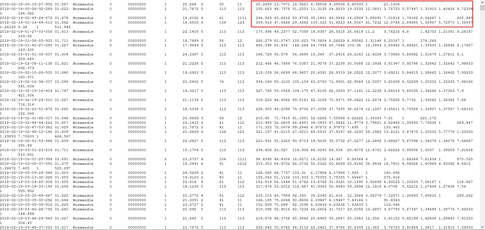

```{r "setup", include=FALSE}
# Configuration locale du chemin du projet SIWIM :
knitr::opts_knit$set(root.dir = normalizePath("D:/Dropbox/Data science/Formation CEPE/Projet/GitHub/SiWIM-project")) 
# options(encoding = 'UTF-8')
#options(width = 1000)
```


<div style="width:1200px; height:700px; left: 50px;">

</div>


